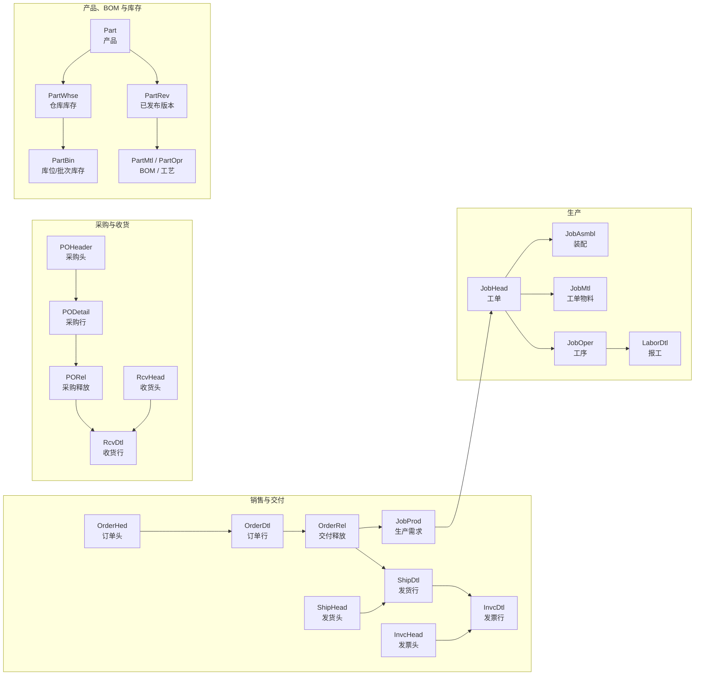

# ERP 领域知识基线

版本：`v1.0`

验证日期：`2026-07-10`

定位：供 ERP SQL Agent、ProductConfigAgent 及后续客服、销售、采购、生产、库存、财务类 Agent 共同引用的领域说明书。

## 1. 使用边界

本文说明“数据是什么、如何关联、哪些口径可靠、哪些仍不确定”，不授予调用方任意 SQL 或 ERP 写权限。

- ERP 身份、关联键和业务口径必须带 `Company`；业务 Agent 只能通过 ERP Data Gateway 或 `agentRuntime` 的同等受控边界访问。
- 所有实库验证均为 `SELECT` 只读聚合；未写 ERP、PostgreSQL、ProductConfig extraction/archive，也未启动 worker、refresh、job 或业务 LLM。
- 历史报表 SQL 是检索证据，不是可直接执行的模板。硬编码 Company、FineReport 宏、旧 `PUB.*`、错误 JOIN 和本地别名必须重新验证。
- 客户、联系人、地址、电话、员工文本、价格和完整配置文件名不进入本文。金额类 SQL 必须继续遵守权限、脱敏和财务口径审批。

### 1.1 证据等级

| 等级 | 含义 | 可否直接形成规则 |
| --- | --- | --- |
| E1 | 技术人员确认，或 ERP 实库精确身份/订单/聚合验证 | 可以，但仍需注明范围和 `asOf` |
| E2 | Epicor contract XML、当前字段元数据、已通过 guard 的模板 | 可形成结构规则；业务含义仍可能需 owner 确认 |
| E3 | 多份历史报表 SQL、跨文档重复模式 | 只作候选和排序证据 |
| E4 | 名称、编号、后缀、相似度等启发式 | 不得单独产生 `matched` 或财务 `exact` |

冲突时按 `E1 > E2 > E3 > E4` 处理；无法消歧时返回 `ambiguous/unresolved`，不要猜。

## 2. 当前知识资产与可信度

| 资产 | 2026-07-10 只读盘点 | 结论 |
| --- | ---: | --- |
| ERP schema table metadata | 3,648 张：`Erp 3341 / Ice 302 / Ecf 5` | 覆盖广，但不是已绑定版本的 snapshot |
| ERP schema field metadata | 107,899 个字段，覆盖 4,282 个表键 | 有 988 个 `Erp` 表键、18,304 个字段找不到对应 table metadata，存在导入漂移 |
| 历史 FineReport | 3,417 份报表、4,085 个 dataset | 2,259 个 dataset 完全未分类；表名抽取含中文别名、大小写重复和 `PUB/Erp` 混用 |
| SQL reference family | 16 个 | 可用于检索；family 中的 JOIN 仍可能是历史错误 |
| approved query template | 21 个 | 表示当前 runtime 已 guard/批准，不等于所有业务 owner 已完成口径审批 |
| metric catalog | finance 18、inventory 1 个标记 `approved` | exact 仍要求当前 schema guard、权限、语义匹配和治理资产状态 |
| schema snapshot registry | 0 条 | 当前不能声称已有版本化、可追溯的 ERP schema snapshot |
| ProductConfig ERP 身份总账 v1.1 | 400 个报价包、648 条产品记录 | `matched 99 / ambiguous 415 / unresolved 134 / failed 0`，弱标题编号不冒充身份 |

因此，未来 Agent 应把当前 schema metadata 当作“候选字段目录”，执行前仍用 live guard/只读编译验证；不能只因历史 SQL 或 metadata 中出现过字段就宣称可用。

## 3. 全局身份与数据粒度

ERP 当前存在三个 Company：`jctimes`、`JingyiMT`、`jytimes`。

实库中有 125,463 个 `PartNum` 同时存在于多个 Company。`PartNum` 不是全局唯一键，产品身份必须使用：

```text
Company + PartNum
```

同理，所有业务键都必须把 `Company` 放在第一层：

| 对象 | 推荐身份/粒度 |
| --- | --- |
| 产品 | `Company + PartNum` |
| 销售订单头/行/释放 | `Company + OrderNum` / `+ OrderLine` / `+ OrderRelNum` |
| 发货头/行 | `Company + PackNum` / `+ PackLine` |
| AR 发票头/行 | `Company + InvoiceNum` / `+ InvoiceLine` |
| 工单/装配/物料/工序 | `Company + JobNum` / `+ AssemblySeq` / `+ MtlSeq` / `+ OprSeq` |
| 报工行 | `Company + LaborHedSeq + LaborDtlSeq`；连接工序另用 `JobNum + AssemblySeq + OprSeq` |
| 采购订单头/行/释放 | `Company + PONum` / `+ POLine` / `+ PORelNum` |
| 收货头/行 | `Company + VendorNum + PurPoint + PackSlip` / `+ PackLine` |
| 仓库库存 | `Company + PartNum + WarehouseCode` |
| 库位库存 | `Company + PartNum + WarehouseCode + BinNum + LotNum` |
| 批次 | `Company + PartNum + LotNum` |
| 已发布版本 | `Company + PartNum + RevisionNum + AltMethod` |

`SysRowID` 是行级 GUID，可用于稳定翻页/审计，但不能代替业务键解释业务关系。

## 4. 核心业务链



### 4.1 已验证的 JOIN

下表为 live ERP 全量聚合验证结果；“孤儿”只反映 2026-07-10 快照，不是永恒约束。

| 子表 → 父表 | JOIN 键（均含 Company） | 子表行数 | 孤儿 |
| --- | --- | ---: | ---: |
| `OrderDtl → OrderHed` | `OrderNum` | 387,768 | 0 |
| `OrderRel → OrderDtl` | `OrderNum + OrderLine` | 387,771 | 0 |
| `ShipDtl → ShipHead` | `PackNum` | 352,674 | 0 |
| `InvcDtl → InvcHead` | `InvoiceNum` | 360,211 | 0 |
| `JobProd → JobHead` | `JobNum` | 194,999 | 0 |
| `JobMtl → JobHead` | `JobNum` | 3,592,656 | 0 |
| `JobOper → JobHead` | `JobNum` | 4,421,029 | 0 |
| `LaborDtl → JobOper` | `JobNum + AssemblySeq + OprSeq` | 3,219,543 个有 JobNum 的报工 | 6 |
| `PODetail → POHeader` | `PONum` | 979,488 | 0 |
| `PORel → PODetail` | `PONum + POLine` | 979,585 | 1 |
| `RcvDtl → RcvHead` | `VendorNum + PurPoint + PackSlip` | 950,893 | 0 |

完整性审计应从子表 `LEFT JOIN` 父表并保留孤儿；常规业务查询在明确排除孤儿后可用 `INNER JOIN`。金额/数量跨一对多关系时，先按目标粒度预聚合再 JOIN，禁止直接把订单行金额复制到多个 release、发货、报工或交易行。

## 5. 模块规则

### 5.1 产品、分类与 ProductConfig 绑定

`Part` 是产品主数据。`ProdCode` 连接 `ProdGrup`，`ClassID` 连接 `PartClass`；两者是不同维度。`PartClass=1010 模头` 同时覆盖多种模头，不能细分平模、涂布模头和圆模头。

公司当前已验证的 ProdCode 语义：

| ProdCode | 领域解释 |
| --- | --- |
| `0910` | 平模头 |
| `0918` | 高端平模头，仍属平模产品族 |
| `091031` | 涂布模头 |
| `091020` | 圆模头/吹膜圆模 |
| `091001` | 模头半成品/未完工工件 |
| `0901` | 定型模 |
| `0902` / `0903` / `0904` | 计量泵 / 换网器 / 分配器 |
| `0905` / `0906` / `0907` | 液压站 / 连接器 / 静态混合器 |
| `0909` | 风刀 |
| `P504` | 自制固定资产，是管理分类，不是配置产品族 |
| `401/403/404/405/406` | 维修/服务类，不直接映射为成品族 |

六位主号及后缀是 E4 候选提示。实库聚合显示相关性很强，例如 `jctimes` 中 `0906/-200` 14,204 条、`0904/-300` 7,995 条、`0903/-400` 5,600 条、`0902/-500` 5,276 条、`0907/-600` 603 条、`0905/-700` 4,743 条、`0909/-800` 160 条；但每一类都存在交叉例外。`-100` 广泛出现在多个 ProdCode，通常表示当前产品的销售套件；嵌套 `-500-100` 表示 `-500` 产品自己的套件。

ProductConfig 的关联顺序必须是：

1. 精确的 item `Company + PartNum`；
2. 真实 ERP `OrderNum` 的完整 `OrderDtl`，再按产品名称、ProdCode、数量和包内顺序一对一分配；
3. 产品描述、ProdCode、ClassID、后缀只用于候选召回和排序；
4. 合同号不默认等于 ERP `OrderNum`；文档级六位号不能无证据分给多产品包中的某一项；
5. BOM 存在只证明有制造结构，不证明产品族分类正确。

配置表表示“报价产品包”，不强制唯一主产品。产品族、成品形态、配置变体、ERP 身份和销售套件必须分层保存。

### 5.2 BOM 与工艺路线

- `Part.Method` 是“存在制造方法”的提示位，不是 BOM 真值。实库有 331 个 `Method=1` 但没有 `PartMtl` 的产品，也有 20 个 `Method=0` 但存在 `PartMtl` 的产品。
- 已发布方法从 `PartRev` 读取；当前 BOM/工艺应选择 `Approved=1`、`EffectiveDate <= asOf` 的版本，并用完整版本键连接 `PartMtl/PartOpr`。
- `PartMtl` 表示父产品的组件材料，组件字段是 `MtlPartNum`；不要把父项 `PartNum` 和组件 `MtlPartNum` 反用。
- `ECORev/ECOMtl/ECOOpr` 是工程工作台数据。查询“正在设计/待批准的工程 BOM”时使用 ECO；查询当前已发布 BOM 时不能默认用 ECO 替代 `PartRev/PartMtl/PartOpr`。
- `EXISTS PartMtl(Company, PartNum)` 只适合回答“是否曾存在材料结构”；正式展开必须带版本和替代方法。

### 5.3 销售、发货与发票

- `OrderHed → OrderDtl → OrderRel` 分别是订单、订单行、交付释放。打开状态优先使用 `OpenOrder/OpenLine/OpenRelease`，作废使用 `VoidOrder/VoidLine/VoidRelease`。
- 本地 `OrderDtl.LineStatus` 同时出现中文、英文和空值，且不总与 `OpenLine` 一致；保留原值用于展示/审计，不能替代系统布尔状态。
- `JobProd.OrderNum=0` 表示 build-to-stock；大于 0 时按 `Company + OrderNum + OrderLine + OrderRelNum` 连接销售需求。当前 179,468 个订单需求行均可连接 `OrderRel`。
- `ShipDtl` 使用同一销售释放键连接 `OrderRel`；发货头按 `Company + PackNum` 连接。
- `InvcDtl` 可按 `PackNum + PackLine` 追溯发货，但 9,338 个发票行没有发货引用，另有 98 个有引用但未匹配当前 `ShipDtl`。发票查询必须容纳 miscellaneous、历史清理或其他生成路径。
- 订单金额、待发金额、发货金额、发票收入和回款余额是五种不同 grain/时间/状态口径，禁止互相冒充。

### 5.4 生产与报工

- `JobHead` 是工单；打开在制通常要求 `JobClosed=0 AND JobComplete=0`，是否再要求 `JobReleased=1/JobEngineered=1` 由问题决定。
- `JobMtl` 的需求物料字段是 `PartNum`，主键层级是 `JobNum + AssemblySeq + MtlSeq`；剩余发料量需明确 `RequiredQty/IssuedQty/IssuedComplete` 的口径。
- `JobOper` 的工序层级是 `JobNum + AssemblySeq + OprSeq`；`LaborDtl` 用同一层级连接。只按 `JobNum` 连接会造成行数爆炸。
- `LaborType` 当前实数主要为 `P`（production）和 `S`（setup）；`TimeStatus` 有空、`A`、`E`。报工、审核工时和生产进度必须分别说明过滤条件。

### 5.5 采购与收货

- `POHeader → PODetail → PORel` 使用完整采购键；`RcvDtl` 回连 `PORel` 使用 `PONum + POLine + PORelNum`，当前 944,937 个有采购号的收货行均可连接。
- PO 打开/作废优先 `OpenOrder/VoidOrder`，行和释放使用 `OpenLine/VoidLine`、`OpenRelease/VoidRelease`。
- `POHeader.ApprovalStatus` 当前主要为 `A/U/P`；`PORel.Status` 主要为 `C/V/O/M`。解释时返回原值并提供映射，不要静默改写。
- `PORel.TranType` 的规范值包括 `PUR-STK/PUR-SUB/PUR-MTL/PUR-UKN`，但 `jctimes` 中还存在金额和物料描述型脏值。必须使用白名单识别，未知值保留并报警，不能强制归类。
- 采购金额、收货金额和 AP 发票金额是不同口径；及时率还需业务 owner 确认“承诺日期/要求日期/到货日期”和部分收货规则。

### 5.6 库存

- 当前现存量以 `PartWhse.OnHandQty` 为仓库粒度权威汇总；库位/批次明细使用 `PartBin.OnhandQty`。
- `PartWhse`、`PartBin`、`PartLot` 的上述业务键在当前快照均无重复。
- 19,463 个正库存仓库行中，3 个没有对应 bin，5 个与 bin 汇总不一致。需要库位明细时可以从 `PartBin` 查，但不能因此覆盖 `PartWhse` 的仓库现存量。
- `PartTran` 是交易事实；`TranType` 必须决定入出库、生产、采购、调整、RMA 等语义。当前常见值不代表完整枚举，未知值保持可见。
- 可用量、ATP、安全库存、库龄/呆滞和现存量不是同一指标；本文只确认 `inventory_on_hand_qty = SUM(PartWhse.OnHandQty)` 的当前 operational 口径。

### 5.7 财务与金额

- 财务问题先选业务事实：订单、release、发货、发票、收款、采购、收货、生产成本或总账，再选金额字段和日期。
- 当前 metric catalog 的 `approved` 仅表示 Agent runtime 可采用的版本状态；仍必须通过权限、当前 schema guard、semantic guard 和治理资产检查。
- 已确认的 operational 例子包括：待发数量/金额使用打开的 `OrderRel`；发货金额按发货数量分摊订单行金额；逾期回款使用已过账、未关闭、余额大于 0 且到期日已过的 `InvcHead`；生产成本组件只使用 `MFG-STK/MFG-CUS` 的 `PartTran`。
- 税、退款、贷项、冲销、币种、汇率、成本月份、总账科目和符号规则未被具体问题覆盖时，不允许输出财务 `exact`。

## 6. 日期和状态安全规则

当前实库存在真实异常日期：`OrderRel.ReqDate` 最大到 2594 年，`POHeader.OrderDate` 到 2204 年，`PORel.DueDate` 有 14 条早于 2000 年且最大到 2121 年，`JobHead.ReqDueDate` 到 2519 年。

因此“最近、最新、本月、今年、趋势”查询必须：

1. 选择与问题一致的业务日期，不用编号、文本日期或导入时间冒充；
2. 默认增加 `date >= '20000101'` 且 `date < DATEADD(year, 1, CAST(GETDATE() AS date))` 的安全范围；
3. 对未来交期类问题允许显式放宽上界，但要返回异常日期计数；
4. `InvoiceNum`、`ShipToNum`、`PayDates`、`TranReference` 不是日期；
5. 同时输出使用的日期字段、时区/截至时间和排除的异常行数。

状态过滤不能使用通用的“所有 `Void*`、`Open*` 一刀切”替代业务判断。默认排除明确作废记录；是否只取打开、已过账、已完成或已审核由问题语义决定。

## 7. 供 Agent 生成 SQL 的工作协议

每次生成 SQL 前按顺序回答：

1. **目的与权限**：谁在查、用途、Company/module/部门/客户范围是什么？
2. **结果 grain**：一行代表产品、订单行、release、工单物料、仓库、发票还是交易？
3. **身份键**：输出并 JOIN 哪组完整复合键？
4. **事实表**：问题真正对应订单、发货、发票、库存、交易、报工还是总账？
5. **时间字段**：业务发生、要求、承诺、发货、开票、到期、收货或交易日期是哪一个？
6. **状态字段**：打开、作废、完成、过账、审核和异常分别如何处理？
7. **一对多控制**：哪些明细必须先预聚合，怎样避免重复金额/数量？
8. **不确定性**：哪些规则只有历史 SQL/命名证据，需返回 warning 或 blocker？
9. **执行保护**：`SELECT` only、TOP/分页、稳定排序、deadline、schema guard、semantic guard、审计和脱敏是否齐全？

最小 SQL 结构示例仅用于说明键和 grain，参数必须由受控模板/服务渲染，不允许调用方字符串拼接：

```sql
-- Company + PartNum 精确产品身份
SELECT TOP (@maxRows)
  p.Company, p.PartNum, p.PartDescription, p.ProdCode, pg.Description AS ProdGroupName,
  p.ClassID, pc.Description AS PartClassName
FROM Erp.Part p
LEFT JOIN Erp.ProdGrup pg ON pg.Company = p.Company AND pg.ProdCode = p.ProdCode
LEFT JOIN Erp.PartClass pc ON pc.Company = p.Company AND pc.ClassID = p.ClassID
WHERE p.Company = @company AND p.PartNum = @partNum
ORDER BY p.Company, p.PartNum;
```

```sql
-- 先查询候选版本，再显式传入 RevisionNum 和 AltMethod；不要静默挑版本
SELECT
  r.Company, r.PartNum, r.RevisionNum, r.AltMethod,
  m.MtlSeq, m.MtlPartNum
FROM Erp.PartRev r
INNER JOIN Erp.PartMtl m
  ON m.Company = r.Company
 AND m.PartNum = r.PartNum
 AND m.RevisionNum = r.RevisionNum
 AND m.AltMethod = r.AltMethod
WHERE r.Company = @company
  AND r.PartNum = @partNum
  AND r.RevisionNum = @revisionNum
  AND r.AltMethod = @altMethod
  AND r.Approved = 1
  AND r.EffectiveDate <= @asOf
ORDER BY m.MtlSeq;
```

如果调用方只说“查产品/查订单/查成本”而未给 Company、时间、状态或结果 grain，Agent 应先收敛口径，不能用默认单公司和默认金额字段补齐。

## 8. 已知阻断与待确认问题

| 问题 | 当前处理 |
| --- | --- |
| 无正式 schema snapshot/ERP 版本 | metadata 只作候选；每次执行重新 guard，不能宣称 snapshot exact |
| `JCJDY.dbo.ProductQuotation*` 的可信 Company/租户字段未证明 | quotation family 保持受限；不能绕过 scope |
| 988 个 orphan table keys、18,304 个 orphan fields | 修复导入和 snapshot 前，不把 metadata coverage 当完整性证明 |
| 历史 family 含错误/缺 Company JOIN | 只作 retrieval，最终 SQL 从实际字段和完整键重建 |
| 98 个发票发货引用、6 个报工工序引用、1 个采购释放存在孤儿 | 完整性审计用 `LEFT JOIN`，业务查询记录排除数量 |
| `PORel.TranType` 有非规范脏值 | 白名单 + unknown，不自动修复生产 ERP |
| 定型模拖辊装置归 `P504/M8` | ERP 身份已确认，产品族仍需技术人员确认 |
| 板材/片材厚度与结构边界 | 文档未明确时保留 `board_sheet`，不按厚度硬拆 |
| `-800/-900` 正式编号规则 | 继续仅作候选提示 |
| 财务税/退款/币种/总账符号等 | 缺 owner 对账和审批时只能 `estimate/blocked` |

## 9. 维护方式

发现新规律时，按以下方式更新：

1. 保存只读查询目的、`asOf`、Company 范围、结果粒度、聚合计数和查询 hash；不保存无关明细或敏感数据。
2. 先写 evidence：声明是 E1/E2/E3/E4、适用 Company/模块和反例。
3. ProductConfig/ERP 身份事实同步更新 `product-config-domain-knowledge` skill 的 `evidence-log.md`；稳定规则只更新一个对应 reference，未解决问题进入 `open-questions.md`。
4. 通用 ERP 规则更新本文；需要进入运行时的规则再单独修改 `knowledge/rules/*.json`，并增加会在修改前失败的最小回归测试。
5. 规则涉及财务、权限、数据结构、真实写入或外部 Agent API 时，必须走 owner 审批；文档观察不能自动升级为生产 `exact`。

相关文档：

- [ERP Data Gateway API](../api/erp-data-gateway.md)
- [ERP SQL Agent Runtime Guard](../api/erp-sql-agent.md)
- [ERP SQL 访问控制](../api/erp-sql-access-control.md)
- [ERP SQL Reference Retrieval](erp-sql-reference-retrieval.md)
- [ERP SQL Finance Metrics](erp-sql-finance-metrics.md)
- [ERP SQL 生产资产治理](erp-sql-production-asset-governance.md)
