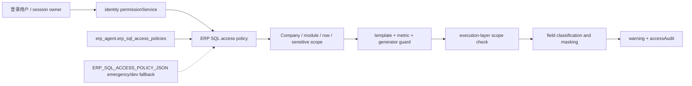

# ERP SQL 权限与数据范围架构

## 信任边界

授权主体只有服务端解析出的 identity user。HTTP `context`、历史会话 context、工具参数、LLM prompt/SQL 和模板动态参数都属于不可信输入，不能产生或扩大授权。

Runtime handler 的 `authorizationContext` 由 `AgentRuntimeService` 调用 handler `authorize` hook 生成，和客户端 `options.context` 分离。handler 校验 scope 的 `actorUserId` 与 session owner 一致后才调用 SQL Agent。

## Policy 规则

- 功能门禁复用 `identity.permissions / role_permissions / user_permission_overrides` 与 `permissionService`。
- 数据范围主来源为 `erp_agent.erp_sql_access_policies`。env JSON 只允许非生产开发 fallback，或生产显式 `ERP_SQL_ACCESS_POLICY_FALLBACK_MODE=emergency`。
- 数据库中已有匹配用户/角色 policy 但未启用、过期或归档时直接拒绝，不回退 env。
- 管理权限 `agent.erp-sql.access-policy:view/manage` 与查询权限 `agent.erp-sql:query` 分离；管理员也不会绕过数据范围。
- Company 永远是具体非空列表，每个允许数据源都必须有显式 scope policy 并改写为带 Company predicate 的派生表。
- 数据源 policy 当前只允许 `Erp.*`、`JCJDY.dbo.ProductQuotation`、`JCJDY.dbo.ProductQuotationDetail`。未知 `dbo`、未建模 JCJDY 表、错误 Company join 或混合 CROSS JOIN 均 fail closed，不能因为同一 SQL 中存在一个受限 `Erp.*` 表就放行其它来源。
- 模块按 planner 结果校验；planner 未给出模块时归为 `custom`，只有显式允许 `custom` 才继续。
- 部门、事业部、客户配置为具体值时，SQL 必须暴露受支持字段以便注入；无法可靠映射时拒绝，而不是退化为全范围。
- 三类敏感字段权限独立判定：finance、customer、employee。

## 字段分类

分类发生在 ERP 返回后、narrator 和 Runtime artifact 之前：

| 分类 | 示例字段信号 | 无 full 权限 |
| --- | --- | --- |
| 财务 | amount、price、cost、margin、balance、金额、成本、毛利 | 返回 `null` |
| 客户 | customer、cust、contact、mobile、email、客户、联系人 | 文本掩码 |
| 员工/报工 | employee、labor、worker、工号、员工、报工、工时 | 文本掩码 |

别名兜底还覆盖 `TotalRevenue`、`SalesValue`、`业务员`、`salesperson/salesrep` 等当前 ERP SQL 输出常见字段；后续接入 schema/approved metric 字段标签后，应以治理标签优先、名称规则兜底。

分类命中和掩码原因进入结构化 access audit；结果 narrator 只看到脱敏后的 rows。

## 待接真实组织映射

identity 当前只有企微部门关系，尚无经过确认的 ERP Company、事业部、ERP 部门、客户组合映射，也没有统一字段字典。生产上线前需要由组织/ERP 管理方提供：

1. identity user / role 到 ERP Company 的权威映射；
2. 企微部门到 ERP Department/Division/BusinessUnit 的映射和层级继承规则；
3. 销售/客服账号到允许客户 `CustNum` 的映射；
4. 各 ERP 表实际承载上述范围的字段清单。

在这些依赖完成前，使用数据库 policy 做最小可落地映射。未知字段、未知模块或缺映射保持 fail closed；不设置 permissive 默认值。`ERP_SQL_ACCESS_POLICY_JSON` 只保留为开发或紧急回退，不作为生产主配置。
